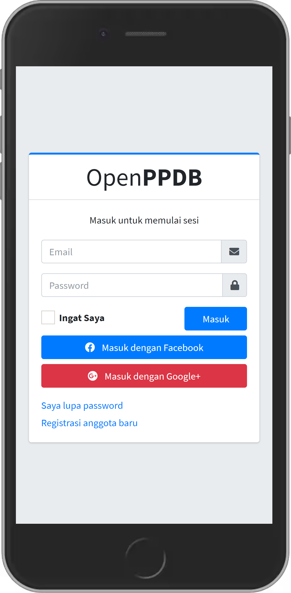
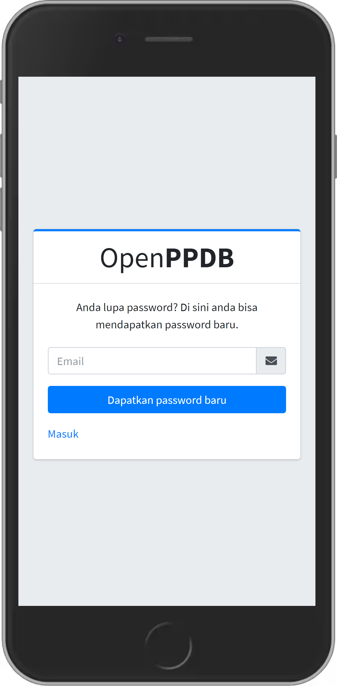
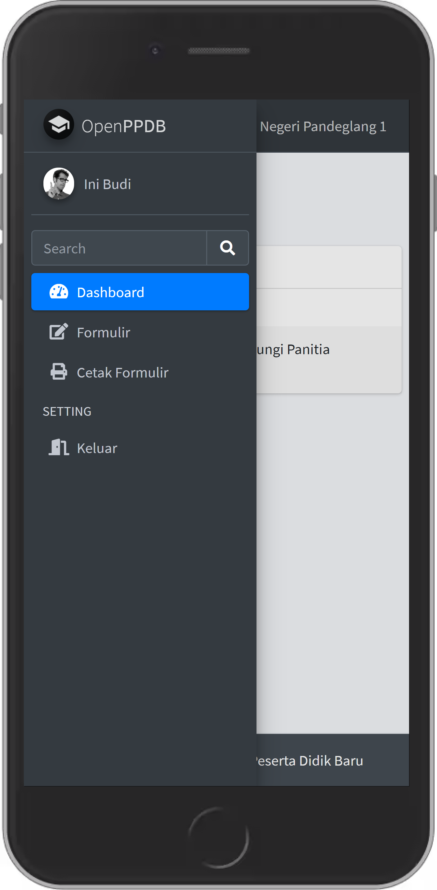

# OPEN Aplikasi Pendaftaran Peserta Didik Baru (OpenPPDB)

Aplikasi Pendaftaran Peserta Didik Baru (Open Source) Berbasis Web menggunakan frameworks Django.

| | |
| :-: | :-: |
|  |  |
|  |  |

# Dokumentasi
Untuk petunjuk penggunaan serta instalasi bisa di lihat di halaman
[Dokumentasi](https://github.com/mashanz/openppdb/wiki)

# Kontak
Apabila ada yang ingin ditanyakan atau butuh bantuan/jasa instalasi. Bisa menghubungi maintainer di kontak berikut.

| Info | Links |
| :- | :- |
| Author |: [mashanz](https://github.com/mashanz) |
| Email |: [hanjara@centragro.org](mailto:hanjara@centragro.org) |