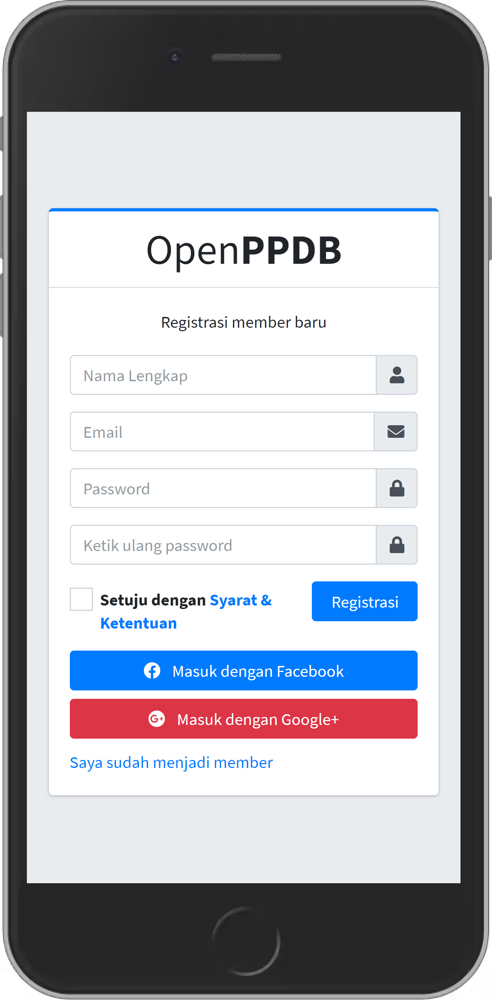
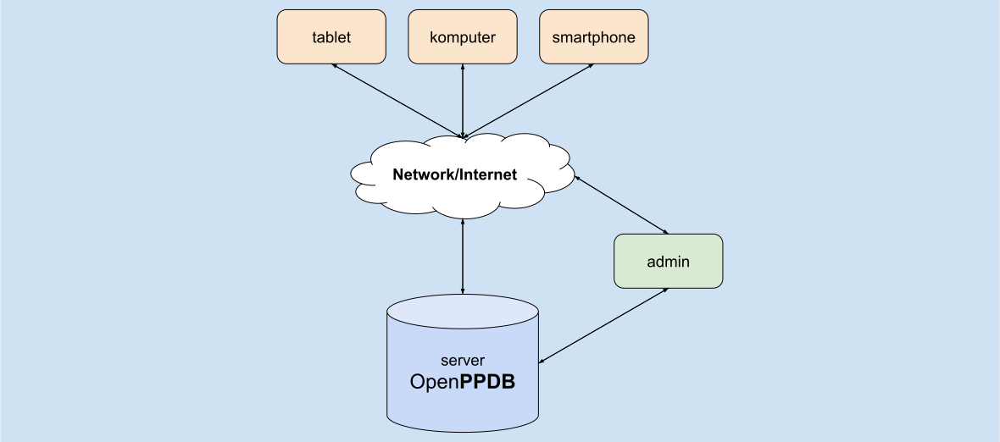

# Aplikasi Pendaftaran Peserta Didik Baru (<b>OpenPPDB</b>)
Aplikasi <b>Pendaftaran Peserta Didik Baru</b> sumber terbuka (<i>Open Source</i>) Berbasis PWA (<i>Progresive Web Application</i>) tersedia <b>`gratis`</b> untuk mempermudah proses <b>PPDB <i>online</i></b>. Unduh gratis rilis aplikasi terbaru [<b>`di sini`</b>](https://github.com/mashanz/openppdb/releases).

### <b>[LIHAT PREVIEW](https://evening-tundra-02558.herokuapp.com/)</b>

### <b>Kelebihan</b>:
1. Aplikasi tersedia <b>`gratis`</b> (Open Source).
2. <b>`Menekan biaya pengembangan`</B> aplikasi yang biasanya jutaan menjadi gratis.
3. <b>`Menghemat waktu`</b> implementasi karna tidak perlu dikembangkan dari awal.
4. Aplikasi <b>`Dapat dikembangkan`</b> kembali sesuai kebutuhan.
5. Aplikasi Support <b>`PWA (Progresive Web Application)`</b> sehingga dapat dibuka di browser komputer, tablet dan smartphone.
6. Dikembangkan menggunakan `Python, JavaScript, HTML dan CSS` sehingga memudahkan dalam pengembangan lebih lanjut.
7. Teknologi web menggunakan framework `Django`, teknologi yang sama digunakan pada <b>`Youtube`, `Google Search`, `Instagram`, `DropBox`</b> dan <b>`Spotify`</b>
8. Tema UI/UX menggunakan `AdminLTE` dengan tampilan antarmuka modern.

### <b>Fitur</b>:
1. Login Pengguna `(OnProgress)`
2. Register Pengguna `(OnProgress)`
3. Halaman Lupa Password `(OnProgress)`
4. Reset/Ganti Password `(OnProgress)`
5. Halaman Profil `(OnProgress)`
6. Form Pendaftaran `(OnProgress)`
7. Cetak Form Pendaftaran `(OnProgress)`
8. Panel Admin/Dashboard `(OnProgress)`
9. Halaman Pengumuman/Dashboard `(OnProgress)`

### <b>Contoh Tampilan Aplikasi pada Mobile Phone</b>

<table style="text-align:center;">
    <tr>
        <td>
             <b>Login</b>
        </td>
        <td>
             <b>Register</b>
        </td>
        <td>
             <b>Recovery</b>
        </td>
        <td>
             <b>Menu</b>
        </td>
    </tr>
</table>

# Menjalankan Apilasi OpenPPDB
1. Download `OpenPPDB_Windows_x64.tar.gz` untuk Windows dan `OpenPPDB-Linux_x64.tar.gz` untuk Linux
2. Extract `OpenPPDB_Windows_x64.tar.gz` untuk Windows dan `OpenPPDB-Linux_x64.tar.gz` untuk Linux
3. Masuk ke dalam Folder `OpenPPDB`
4. Double click `OpenPPDB.bat` untuk Windows dan `OpenPPDB.sh` untuk Linux
5. Buka browser http://localhost/

| Spesifikasi | Spesifikasi Minimal |
| :- | :- |
| OS | Windows 7, Ubuntu 18.04, MacOS 10.11 |
| CPU | 0.6 GHz x64|
| RAM | 512 MB |
| STORAGE | 2 GB |

# Pengembangan
Untuk petunjuk pengembangan dapat dilihat di halaman
[Dokumentasi](https://github.com/mashanz/openppdb/wiki/Pengembangan-Aplikasi)

# Spesifikasi Teknis
<table style="text-align:center;">
    <tr>
        <th>
            Framework
        </th>
        <th>
            Versi
        </th>
    </tr>
    <tr>
        <td>
            Python
        </td>
        <td>
            3.7.10
        </td>
    </tr>
    <tr>
        <td>
            Django
        </td>
        <td>
            2.2.10
        </td>
    </tr>
    <tr>
        <td>
            AdminLTE
        </td>
        <td>
            3.1.0
        </td>
    </tr>
    <tr>
        <td>
            Bootstrap
        </td>
        <td>
            3
        </td>
    </tr>
</table>

# Arsitektur

# Bug Report
Apabila ditemukan bug pada code aplikasi ini, anda dapat submit laporan bug tersebut [di sini](https://github.com/mashanz/openppdb/issues). 

# Kontak
Apabila ada kritik, saran atau ada yang ingin ditanyakan, Bisa menghubungi maintainer/pengembang di kontak berikut. Terimakasih.

| Info | Links |
| :- | :- |
| Author |: [mashanz](https://github.com/mashanz) |
| Email |: [hanjara@centragro.org](mailto:hanjara@centragro.org) |